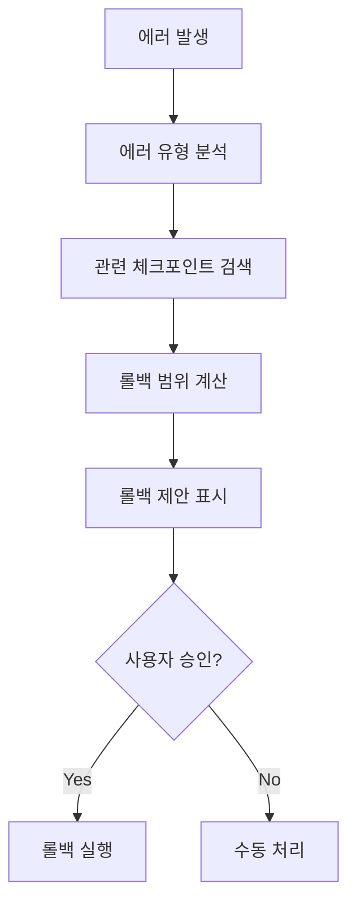

# Auto-Checkpoint - Rollback Guide

## 스마트 롤백 시스템

### 에러 발생 시 자동 분석



### 에러 유형별 롤백 전략

| 에러 유형 | 권장 범위 | 자동 제안 |
|----------|----------|----------|
| 빌드 실패 | 파일 레벨 | ✅ |
| 테스트 실패 | 함수 레벨 | ✅ |
| 런타임 에러 | 파일 레벨 | ✅ |
| 설정 에러 | 설정 파일만 | ✅ |
| 심각한 오류 | 스테이지 레벨 | 확인 필요 |

## 롤백 범위

### 1. 파일 레벨 롤백
```bash
# 특정 파일만 체크포인트에서 복원
/restore --checkpoint "auto_task_5" --files "src/auth/UserService.ts"
```

**적합한 상황**:
- 단일 파일 변경으로 인한 오류
- 특정 모듈 롤백

### 2. 함수 레벨 롤백
```bash
# 특정 함수만 복원 (지원 언어: TS, JS, Python)
/restore --checkpoint "auto_task_5" --function "UserService.login"
```

**적합한 상황**:
- 리팩토링 중 특정 함수 문제
- 부분적 로직 오류

### 3. 스테이지 레벨 롤백
```bash
# 전체 스테이지 상태 복원
/restore --checkpoint "stage_06_start"
```

**적합한 상황**:
- 광범위한 문제
- 아키텍처 수준 변경 취소

### 4. 설정 파일만 롤백
```bash
/restore --checkpoint "auto_change" --config-only
```

**적합한 상황**:
- 설정 변경으로 인한 오류
- 환경 설정 문제

## 롤백 미리보기

```markdown
## 롤백 미리보기

**대상 체크포인트**: auto_task_5_20240120
**롤백 범위**: 파일 레벨

### 복원될 파일 (3개)
| 파일 | 현재 크기 | 복원 크기 | 변경량 |
|------|----------|----------|--------|
| src/auth/UserService.ts | 250줄 | 180줄 | -70줄 |
| src/types/auth.ts | 50줄 | 45줄 | -5줄 |
| tests/auth.test.ts | 100줄 | 80줄 | -20줄 |

### 잃게 될 변경사항
- 비밀번호 해시 기능 추가 (UserService.ts:45-80)
- 새 타입 정의 (auth.ts:40-50)
- 관련 테스트 (auth.test.ts:70-100)

### 영향받는 의존성
- LoginForm 컴포넌트 (import 확인 필요)

**이 롤백을 실행하시겠습니까? (y/n)**
```

## 롤백 실행 프로세스

### 사전 작업
1. 현재 상태 백업 체크포인트 생성
2. 커밋되지 않은 변경사항 stash

### 롤백 단계
1. 체크포인트 유효성 검증
2. 파일 추출
3. 선택적 파일 복원
4. 무결성 확인
5. 상태 파일 업데이트

### 사후 작업
1. 검증 테스트 실행
2. HANDOFF 업데이트
3. 롤백 기록 저장

## 복구 가이드 자동 생성

```markdown
## 파일 롤백 완료

**체크포인트**: auto_task_5_20240120
**복원된 파일**: 3개
**시간**: 2024-01-20 14:45:00

### 복구된 파일
- src/auth/UserService.ts
- src/types/auth.ts
- tests/auth.test.ts

### 권장 다음 단계
1. 변경사항 확인: `git diff`
2. 테스트 실행: `npm test`
3. 문제가 해결되었다면:
   - 원인 분석 후 다시 구현
   - 더 작은 단위로 작업
4. 문제가 지속된다면:
   - 추가 롤백 필요 가능성
   - `/restore --suggest` 실행
```

## 안전 장치

### 롤백 차단 조건
- 커밋되지 않은 변경사항 존재
- 활성 프로세스 실행 중
- 파일 잠금 상태

### 확인 필요 조건
- 스테이지 레벨 롤백
- 10개 이상 파일 영향
- 프로덕션 관련 파일 포함

### 쿨다운
- 연속 롤백 간 5분 대기
- 같은 체크포인트 재롤백 경고
