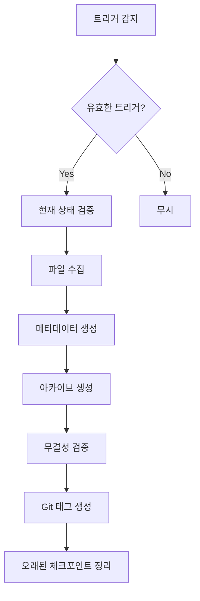

# Auto-Checkpoint - Trigger Guide

## 체크포인트 트리거 조건

### 1. 태스크 완료 기반
```yaml
trigger:
  condition: "tasks_completed"
  threshold: 5
  action: "create_checkpoint"
```

**감지 방법**:
- TodoWrite에서 `completed` 상태 카운트
- 커밋 기록 분석

### 2. 파일 변경 기반
```yaml
trigger:
  condition: "major_file_change"
  threshold: 100  # lines
  weights:
    "*.ts": 1.0
    "*.yaml": 0.5
    "*.md": 0.3
```

**감지 방법**:
```bash
# 변경량 계산
git diff --stat | awk '{sum+=$4} END {print sum}'
```

### 3. 파괴적 작업 전
```yaml
trigger:
  condition: "destructive_action"
  patterns:
    - "rm -rf"
    - "git reset --hard"
    - "drop table"
```

**감지 시 동작**:
1. 즉시 체크포인트 생성
2. 사용자 확인 요청
3. 확인 후 작업 진행

### 4. 시간 기반
```yaml
trigger:
  condition: "interval"
  interval_minutes: 30
  only_if_changes: true
```

### 5. 스테이지 기반
```yaml
trigger:
  conditions:
    on_stage_complete: true
    on_stage_error: true
```

## 체크포인트 생성 프로세스



## 메타데이터 형식

```yaml
checkpoint:
  name: "auto_task_5_20240120_143022"
  timestamp: "2024-01-20T14:30:22Z"
  trigger: "tasks_completed"
  stage: "06-implementation"
  task_count: 25
  files_changed: 12
  git_commit: "abc1234"

  summary:
    completed_tasks: 5
    modified_files:
      - "src/auth/UserService.ts"
      - "src/components/LoginForm.tsx"
    key_changes: "사용자 인증 시스템 구현"
```

## 보존 정책

```yaml
retention:
  max_checkpoints: 20
  max_age_days: 30

  # 절대 삭제 안함
  milestones:
    - stage_complete
    - pre_destructive
    - user_created
```

## 명명 규칙

| 트리거 | 형식 | 예시 |
|--------|------|------|
| 태스크 | `auto_task_{count}_{timestamp}` | `auto_task_5_20240120` |
| 파일변경 | `auto_change_{timestamp}` | `auto_change_20240120_143022` |
| 파괴적 | `pre_destructive_{timestamp}` | `pre_destructive_20240120_143022` |
| 스테이지 | `stage_{id}_{status}_{timestamp}` | `stage_06_complete_20240120` |
| 수동 | `manual_{name}_{timestamp}` | `manual_feature_complete_20240120` |
