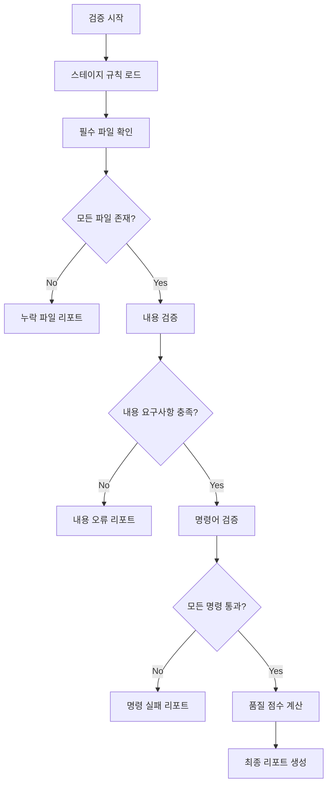

# Output Validator - Validation Process

## 검증 프로세스



## 단계별 검증

### 1. 필수 파일 확인

```yaml
# 검증 규칙 예시
required_outputs:
  ideas.md:
    exists: true
    min_size_bytes: 500

  "source_code/":
    exists: true
    is_directory: true
```

**검증 결과**:
```markdown
## 파일 존재 확인
✅ ideas.md (1,234 bytes)
✅ source_code/ (directory)
❌ requirements_analysis.md (누락)
```

### 2. 내용 검증

```yaml
content_checks:
  min_ideas: 5
  sections:
    - "기능 요구사항"
    - "비기능 요구사항"
  has_priorities: true
```

**검증 방법**:
- 마크다운 파싱으로 섹션 확인
- 패턴 매칭으로 필수 요소 확인
- 카운팅으로 최소 요건 확인

**검증 결과**:
```markdown
## 내용 검증
✅ ideas.md: 8개 아이디어 (최소 5개)
⚠️ requirements_analysis.md: "비기능 요구사항" 섹션 누락
✅ project_plan.md: 모든 필수 섹션 포함
```

### 3. 명령어 검증

```yaml
validation_commands:
  - name: "lint"
    command: "npm run lint"
    required: true
    allow_warnings: true

  - name: "typecheck"
    command: "npm run typecheck"
    required: true

  - name: "test"
    command: "npm run test"
    required: true
```

**실행 및 결과**:
```markdown
## 명령어 검증
✅ lint: 통과 (경고 2개)
✅ typecheck: 통과
❌ test: 실패 (3개 테스트 실패)
   - tests/auth.test.ts: loginUser should return token
   - tests/auth.test.ts: logout should clear session
   - tests/user.test.ts: createUser validation
```

### 4. 품질 점수 계산

```yaml
quality_metrics:
  lint_score:
    weight: 0.3
    target: 0.9
  test_coverage:
    weight: 0.4
    target: 0.8
  type_coverage:
    weight: 0.3
    target: 0.95
```

**계산 결과**:
```markdown
## 품질 점수
| 메트릭 | 현재 | 목표 | 점수 |
|--------|------|------|------|
| Lint | 0.95 | 0.90 | ✅ 1.0 |
| Coverage | 0.75 | 0.80 | ⚠️ 0.94 |
| Types | 0.98 | 0.95 | ✅ 1.0 |

**종합 점수**: 0.97 (가중 평균)
**상태**: 통과 (최소 0.7)
```

## 최종 리포트 형식

```markdown
# 산출물 검증 리포트

## 스테이지: 06-implementation
## 검증 시간: 2024-01-20 14:30:00

## 요약
- **상태**: ⚠️ 부분 통과
- **종합 점수**: 0.85
- **통과 항목**: 8/10
- **실패 항목**: 2

## 상세 결과

### ✅ 통과 항목
1. 필수 파일 존재
2. Lint 검사
3. Type 검사
...

### ❌ 실패 항목
1. 테스트 실패 (3개)
2. 커버리지 미달 (75% < 80%)

## 수정 필요 사항
1. [ ] tests/auth.test.ts 수정
2. [ ] 테스트 커버리지 5% 향상

## 권장 조치
- 실패한 테스트 케이스 확인 및 수정
- 누락된 테스트 추가
```

## 실패 시 동작

### 스테이지 전환 차단
```yaml
on_failure:
  action: "block_transition"
  allow_override: true
  require_justification: true
```

### 오버라이드 프롬프트
```markdown
⚠️ 검증 실패로 스테이지 전환이 차단되었습니다.

**실패 사항**:
- 테스트 실패: 3개
- 커버리지 미달: 75%

강제로 진행하시겠습니까?
(이유를 입력하세요, 또는 'cancel'로 취소)
> _
```
