# 🔄 Snake Game - 사용자 플로우

> 생성일: 2026-01-21
> 스테이지: 04-ui-ux
> 프로젝트: snake-game

---

## 1. 전체 게임 플로우

```mermaid
graph TD
    A[앱 접속] --> B[Start Screen]

    B --> |Start 버튼 클릭| C[Game Playing]
    B --> |How to Play| B1[Instructions Modal]
    B1 --> |닫기| B

    C --> |방향키/스와이프| C
    C --> |ESC/P/Pause버튼| D[Pause Overlay]

    D --> |Resume| C
    D --> |Quit| B

    C --> |벽/자기몸 충돌| E[Game Over Modal]

    E --> F{최고 점수 갱신?}
    F -- Yes --> G[localStorage 저장]
    F -- No --> H[점수 표시]
    G --> H

    H --> |Play Again| C
    H --> |Main Menu| B
```



---

## 2. 핵심 사용자 플로우

### 2.1 게임 시작 플로우

```
[Start Screen]
      │
      ▼
 사용자: Start 버튼 클릭 또는 Enter 키
      │
      ▼
 시스템: 게임 상태 초기화
      │  - snake: 초기 위치 (10,10)
      │  - food: 랜덤 위치 생성
      │  - score: 0
      │  - direction: RIGHT
      │  - status: PLAYING
      │
      ▼
 시스템: 게임 루프 시작 (requestAnimationFrame)
      │
      ▼
[Game Playing]
```

### 2.2 게임 플레이 루프

```
[Game Playing]
      │
      ▼
┌─────────────────────────────────┐
│  1. 입력 처리                    │
│     - 키보드: Arrow Keys / WASD │
│     - 터치: Swipe / D-Pad       │
│     - 역방향 입력 무시           │
└──────────────┬──────────────────┘
               ▼
┌─────────────────────────────────┐
│  2. 게임 틱 (TICK)              │
│     - 뱀 머리 위치 계산          │
│     - 충돌 감지 실행             │
└──────────────┬──────────────────┘
               ▼
        ┌──────┴──────┐
        │  충돌 타입?  │
        └──────┬──────┘
      ┌────────┼────────┐
      ▼        ▼        ▼
   [벽/자기]  [먹이]   [없음]
      │        │        │
      ▼        ▼        ▼
 Game Over  성장+점수   이동
               │        │
               └────────┴─────► Canvas 렌더링
                                    │
                                    ▼
                            다음 프레임 대기
                                    │
                                    └──► [루프 반복]
```

### 2.3 일시정지 / 재개 플로우

```
[Game Playing]
      │
      ▼
 사용자: ESC / P / Pause 버튼
      │
      ▼
 시스템: status → PAUSED
      │  - 게임 루프 정지
      │  - Pause Overlay 표시
      │
      ▼
[Pause Overlay]
      │
      ├──► 사용자: Resume 버튼
      │         │
      │         ▼
      │    시스템: status → PLAYING
      │         │  - 게임 루프 재개
      │         ▼
      │    [Game Playing]
      │
      └──► 사용자: Quit 버튼
                  │
                  ▼
             시스템: 게임 상태 초기화
                  │
                  ▼
             [Start Screen]
```

### 2.4 게임 오버 플로우

```
[Collision Detected]
      │
      ▼
 시스템: status → GAME_OVER
      │  - 게임 루프 정지
      │
      ▼
 시스템: 최고 점수 비교
      │
      ├──► score > highScore
      │         │
      │         ▼
      │    localStorage 저장
      │    "NEW HIGH SCORE!" 표시
      │
      └──► score <= highScore
                  │
                  ▼
             일반 점수 표시
      │
      ▼
[Game Over Modal]
      │
      ├──► 사용자: Play Again (Enter)
      │         │
      │         ▼
      │    시스템: 게임 리셋 + 시작
      │         │
      │         ▼
      │    [Game Playing]
      │
      └──► 사용자: Main Menu
                  │
                  ▼
             시스템: 게임 리셋
                  │
                  ▼
             [Start Screen]
```

---

## 3. 입력 처리 플로우

### 3.1 키보드 입력

```
 키보드 이벤트 (keydown)
      │
      ▼
┌─────────────────────────────────┐
│  키 매핑                         │
│  ArrowUp / W    → UP            │
│  ArrowDown / S  → DOWN          │
│  ArrowLeft / A  → LEFT          │
│  ArrowRight / D → RIGHT         │
│  ESC / P        → PAUSE         │
│  Enter / Space  → RESTART       │
└──────────────┬──────────────────┘
               ▼
      ┌────────┴────────┐
      │  현재 상태?      │
      └────────┬────────┘
        ┌──────┴──────┐
        ▼             ▼
   [PLAYING]     [GAME_OVER]
        │             │
        ▼             ▼
   방향 변경      재시작 처리
   (역방향 무시)
```

### 3.2 터치/스와이프 입력

```
 터치 이벤트
      │
      ├──► touchstart
      │    - 시작 좌표 저장 (startX, startY)
      │    - 시작 시간 저장
      │
      └──► touchend
           - 종료 좌표 (endX, endY)
           │
           ▼
      ┌─────────────────────────────┐
      │  스와이프 판정               │
      │  - 거리 > 50px (threshold)  │
      │  - 시간 < 500ms             │
      └──────────────┬──────────────┘
                     ▼
            방향 계산 (X vs Y delta)
                     │
           ┌─────────┴─────────┐
           ▼                   ▼
       |deltaX| > |deltaY|  |deltaY| > |deltaX|
           │                   │
      ┌────┴────┐         ┌────┴────┐
      ▼         ▼         ▼         ▼
   LEFT      RIGHT       UP       DOWN
```

---

## 4. 에러/예외 플로우

### 4.1 localStorage 접근 실패

```
 localStorage 작업 시도
      │
      ▼
┌─────────────────────────────────┐
│  try-catch 처리                 │
│                                 │
│  실패 시:                        │
│  - 콘솔 경고 출력               │
│  - highScore = 0 유지           │
│  - 게임은 정상 진행             │
└─────────────────────────────────┘
```

### 4.2 Canvas 지원 안 됨

```
 Canvas 초기화
      │
      ▼
┌─────────────────────────────────┐
│  getContext('2d') 호출          │
│                                 │
│  null 반환 시:                   │
│  - 에러 메시지 화면 표시         │
│  - "Your browser does not       │
│    support Canvas"              │
└─────────────────────────────────┘
```

---

## 5. 상태 전이 다이어그램

```
          START_GAME
    ┌──────────────────┐
    │                  │
    ▼                  │
 [IDLE] ────────► [PLAYING]
    ▲                  │
    │   RESTART        │  PAUSE_GAME
    │                  ▼
    │             [PAUSED]
    │                  │
    │   RESUME_GAME    │
    │  ┌───────────────┘
    │  │
    │  ▼
    │ [PLAYING]
    │      │
    │      │ GAME_OVER (충돌)
    │      ▼
    └── [GAME_OVER]
```

### 상태별 허용 액션

| 현재 상태 | 허용 액션 |
|----------|----------|
| IDLE | START_GAME |
| PLAYING | CHANGE_DIRECTION, PAUSE_GAME, TICK, GAME_OVER |
| PAUSED | RESUME_GAME, RESTART |
| GAME_OVER | RESTART |

---

## ✅ 사용자 플로우 체크리스트

- [x] 전체 게임 플로우 다이어그램
- [x] 게임 시작 플로우
- [x] 게임 플레이 루프
- [x] 일시정지/재개 플로우
- [x] 게임 오버 플로우
- [x] 키보드 입력 처리
- [x] 터치/스와이프 입력 처리
- [x] 에러/예외 플로우
- [x] 상태 전이 다이어그램
